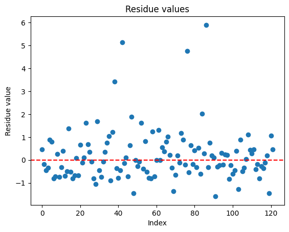

Data scientist salaries analysis
===
*Author: Francisco Javier Sánchez Panduro*\
*Supervised by: Professor Doctor Brenda García Maya*\
*Monterrey Institute of Tecnology and Higher Studies*\
*13 of August 2023*

## Introduction
Using the linear regression model, we aim to predict salaries in dollars for data scientists. Using the features experience level, salary, type of job and remote radio.


```python
import pandas as pd
import numpy as np
from sklearn.preprocessing import StandardScaler
from sklearn.model_selection import train_test_split
import statsmodels.formula.api as smf
import matplotlib.pyplot as plt
from scipy import stats
import statsmodels.api as sm
```

Data preparation
---

Data authored by Bhatia, n.d.

The data includes 11 columns, here explained
| Column | Description |
|---|---|
|work_year	| The year the salary was paid.|
|experience_level|	The experience level in the job during the year with the following possible values: EN Entry-level / Junior MI Mid-level / Intermediate SE Senior-level / Expert EX Executive-level / Director|
|employment_type|	The type of employement for the role: PT Part-time FT Full-time CT Contract FL Freelance|
|job_title	|The role worked in during the year.|
|salary	|The total gross salary amount paid.|
|salary_currency|	The currency of the salary paid as an ISO 4217 currency code.|
|salary_in_usd|	The salary in USD (FX rate divided by avg. USD rate for the respective year via fxdata.foorilla.com).|
|employee_residence|	Employee's primary country of residence in during the work year as an ISO 3166 country code.|
|remote_ratio|	The overall amount of work done remotely, possible values are as follows: 0 No remote work (less than 20%) 50 Partially remote 100 Fully remote (more than 80%)|
|company_location|	The country of the employer's main office or contracting branch as an ISO 3166 country code.|
|company_size|	The average number of people that worked for the company during the year: S less than 50 employees (small) M 50 to 250 employees (medium) L more than 250 employees (large)|


```python
df = pd.read_csv('data/ds_salaries.csv')
df.head()
```


<div>
<table border="1" class="dataframe">
  <thead>
    <tr style="text-align: right;">
      <th></th>
      <th>Unnamed: 0</th>
      <th>work_year</th>
      <th>experience_level</th>
      <th>employment_type</th>
      <th>job_title</th>
      <th>salary</th>
      <th>salary_currency</th>
      <th>salary_in_usd</th>
      <th>employee_residence</th>
      <th>remote_ratio</th>
      <th>company_location</th>
      <th>company_size</th>
    </tr>
  </thead>
  <tbody>
    <tr>
      <th>0</th>
      <td>0</td>
      <td>2020</td>
      <td>MI</td>
      <td>FT</td>
      <td>Data Scientist</td>
      <td>70000</td>
      <td>EUR</td>
      <td>79833</td>
      <td>DE</td>
      <td>0</td>
      <td>DE</td>
      <td>L</td>
    </tr>
    <tr>
      <th>1</th>
      <td>1</td>
      <td>2020</td>
      <td>SE</td>
      <td>FT</td>
      <td>Machine Learning Scientist</td>
      <td>260000</td>
      <td>USD</td>
      <td>260000</td>
      <td>JP</td>
      <td>0</td>
      <td>JP</td>
      <td>S</td>
    </tr>
    <tr>
      <th>2</th>
      <td>2</td>
      <td>2020</td>
      <td>SE</td>
      <td>FT</td>
      <td>Big Data Engineer</td>
      <td>85000</td>
      <td>GBP</td>
      <td>109024</td>
      <td>GB</td>
      <td>50</td>
      <td>GB</td>
      <td>M</td>
    </tr>
    <tr>
      <th>3</th>
      <td>3</td>
      <td>2020</td>
      <td>MI</td>
      <td>FT</td>
      <td>Product Data Analyst</td>
      <td>20000</td>
      <td>USD</td>
      <td>20000</td>
      <td>HN</td>
      <td>0</td>
      <td>HN</td>
      <td>S</td>
    </tr>
    <tr>
      <th>4</th>
      <td>4</td>
      <td>2020</td>
      <td>SE</td>
      <td>FT</td>
      <td>Machine Learning Engineer</td>
      <td>150000</td>
      <td>USD</td>
      <td>150000</td>
      <td>US</td>
      <td>50</td>
      <td>US</td>
      <td>L</td>
    </tr>
  </tbody>
</table>
</div>


```python
print(df.shape)
```

    (607, 12)


```python
df.isnull().sum()
```


    Unnamed: 0            0
    work_year             0
    experience_level      0
    employment_type       0
    job_title             0
    salary                0
    salary_currency       0
    salary_in_usd         0
    employee_residence    0
    remote_ratio          0
    company_location      0
    company_size          0
    dtype: int64


```python
# Create dataframe with only relevant data
df = pd.DataFrame({'experience_level': df['experience_level'], 'employment_type' : df['employment_type'], 'salary_in_usd' : df['salary_in_usd'], 'salary' : df['salary'], 'remote_ratio' : df['remote_ratio']})
df.head()
```


<div>
<table border="1" class="dataframe">
  <thead>
    <tr style="text-align: right;">
      <th></th>
      <th>experience_level</th>
      <th>employment_type</th>
      <th>salary_in_usd</th>
      <th>salary</th>
      <th>remote_ratio</th>
    </tr>
  </thead>
  <tbody>
    <tr>
      <th>0</th>
      <td>MI</td>
      <td>FT</td>
      <td>79833</td>
      <td>70000</td>
      <td>0</td>
    </tr>
    <tr>
      <th>1</th>
      <td>SE</td>
      <td>FT</td>
      <td>260000</td>
      <td>260000</td>
      <td>0</td>
    </tr>
    <tr>
      <th>2</th>
      <td>SE</td>
      <td>FT</td>
      <td>109024</td>
      <td>85000</td>
      <td>50</td>
    </tr>
    <tr>
      <th>3</th>
      <td>MI</td>
      <td>FT</td>
      <td>20000</td>
      <td>20000</td>
      <td>0</td>
    </tr>
    <tr>
      <th>4</th>
      <td>SE</td>
      <td>FT</td>
      <td>150000</td>
      <td>150000</td>
      <td>50</td>
    </tr>
  </tbody>
</table>
</div>


```python
print(df['experience_level'].unique())
```

    ['MI' 'SE' 'EN' 'EX']


```python
print(df['employment_type'].unique())
```

    ['FT' 'CT' 'PT' 'FL']


```python
# Create dummy variables to represent categorical data in numerical form
dummies_experience_level = pd.get_dummies(df['experience_level'], prefix='experience_level', dtype = 'uint8')
dummies_experience_level.head()
```


<div>
<table border="1" class="dataframe">
  <thead>
    <tr style="text-align: right;">
      <th></th>
      <th>experience_level_EN</th>
      <th>experience_level_EX</th>
      <th>experience_level_MI</th>
      <th>experience_level_SE</th>
    </tr>
  </thead>
  <tbody>
    <tr>
      <th>0</th>
      <td>0</td>
      <td>0</td>
      <td>1</td>
      <td>0</td>
    </tr>
    <tr>
      <th>1</th>
      <td>0</td>
      <td>0</td>
      <td>0</td>
      <td>1</td>
    </tr>
    <tr>
      <th>2</th>
      <td>0</td>
      <td>0</td>
      <td>0</td>
      <td>1</td>
    </tr>
    <tr>
      <th>3</th>
      <td>0</td>
      <td>0</td>
      <td>1</td>
      <td>0</td>
    </tr>
    <tr>
      <th>4</th>
      <td>0</td>
      <td>0</td>
      <td>0</td>
      <td>1</td>
    </tr>
  </tbody>
</table>
</div>


```python
dummies_employment_type = pd.get_dummies(df['employment_type'], prefix='employment_type', dtype = 'uint8')
dummies_employment_type.head()
```


<div>
<table border="1" class="dataframe">
  <thead>
    <tr style="text-align: right;">
      <th></th>
      <th>employment_type_CT</th>
      <th>employment_type_FL</th>
      <th>employment_type_FT</th>
      <th>employment_type_PT</th>
    </tr>
  </thead>
  <tbody>
    <tr>
      <th>0</th>
      <td>0</td>
      <td>0</td>
      <td>1</td>
      <td>0</td>
    </tr>
    <tr>
      <th>1</th>
      <td>0</td>
      <td>0</td>
      <td>1</td>
      <td>0</td>
    </tr>
    <tr>
      <th>2</th>
      <td>0</td>
      <td>0</td>
      <td>1</td>
      <td>0</td>
    </tr>
    <tr>
      <th>3</th>
      <td>0</td>
      <td>0</td>
      <td>1</td>
      <td>0</td>
    </tr>
    <tr>
      <th>4</th>
      <td>0</td>
      <td>0</td>
      <td>1</td>
      <td>0</td>
    </tr>
  </tbody>
</table>
</div>


```python
df = pd.concat([df, dummies_employment_type, dummies_experience_level], axis=1)
df.drop('experience_level', axis = 1, inplace=True)
df.drop('employment_type', axis = 1, inplace=True)
df.head()
```


<div>
<table border="1" class="dataframe">
  <thead>
    <tr style="text-align: right;">
      <th></th>
      <th>salary_in_usd</th>
      <th>salary</th>
      <th>remote_ratio</th>
      <th>employment_type_CT</th>
      <th>employment_type_FL</th>
      <th>employment_type_FT</th>
      <th>employment_type_PT</th>
      <th>experience_level_EN</th>
      <th>experience_level_EX</th>
      <th>experience_level_MI</th>
      <th>experience_level_SE</th>
    </tr>
  </thead>
  <tbody>
    <tr>
      <th>0</th>
      <td>79833</td>
      <td>70000</td>
      <td>0</td>
      <td>0</td>
      <td>0</td>
      <td>1</td>
      <td>0</td>
      <td>0</td>
      <td>0</td>
      <td>1</td>
      <td>0</td>
    </tr>
    <tr>
      <th>1</th>
      <td>260000</td>
      <td>260000</td>
      <td>0</td>
      <td>0</td>
      <td>0</td>
      <td>1</td>
      <td>0</td>
      <td>0</td>
      <td>0</td>
      <td>0</td>
      <td>1</td>
    </tr>
    <tr>
      <th>2</th>
      <td>109024</td>
      <td>85000</td>
      <td>50</td>
      <td>0</td>
      <td>0</td>
      <td>1</td>
      <td>0</td>
      <td>0</td>
      <td>0</td>
      <td>0</td>
      <td>1</td>
    </tr>
    <tr>
      <th>3</th>
      <td>20000</td>
      <td>20000</td>
      <td>0</td>
      <td>0</td>
      <td>0</td>
      <td>1</td>
      <td>0</td>
      <td>0</td>
      <td>0</td>
      <td>1</td>
      <td>0</td>
    </tr>
    <tr>
      <th>4</th>
      <td>150000</td>
      <td>150000</td>
      <td>50</td>
      <td>0</td>
      <td>0</td>
      <td>1</td>
      <td>0</td>
      <td>0</td>
      <td>0</td>
      <td>0</td>
      <td>1</td>
    </tr>
  </tbody>
</table>
</div>


## Correlation

The following correlation matrix displays the Pearson correlation coefficients between multiple variables in the dataset. The Pearson correlation coefficient $r$ quantifies the strength and direction of the linear relationship between two variables.

A positive $r$ value indicates a positive correlation; the closer the value is to 1, the stronger the positive correlation. A negative value indicates the opposite, with the value closer to -1 indicating a stronger negative correlation.

To calculate $r$ between two variables $X$ and $Y$, the formula is:

$$
r = \frac{\sum{(X_i - \bar{X})(Y_i - \bar{Y})}}{\sqrt{\sum{(X_i - \bar{X})^2} \cdot \sum{(Y_i - \bar{Y})^2}}}
$$

Where:
- $X_i$ and $Y_i$ are individual data points for variables $X$ and $Y$.
- $\bar{X}$ and $\bar{Y}$ are the means of variables $X$ and $Y$.


```python
correlation_matrix = df.corr()
display(correlation_matrix)
```


<div>
<table border="1" class="dataframe">
  <thead>
    <tr style="text-align: right;">
      <th></th>
      <th>salary_in_usd</th>
      <th>salary</th>
      <th>remote_ratio</th>
      <th>employment_type_CT</th>
      <th>employment_type_FL</th>
      <th>employment_type_FT</th>
      <th>employment_type_PT</th>
      <th>experience_level_EN</th>
      <th>experience_level_EX</th>
      <th>experience_level_MI</th>
      <th>experience_level_SE</th>
    </tr>
  </thead>
  <tbody>
    <tr>
      <th>salary_in_usd</th>
      <td>1.000000</td>
      <td>-0.083906</td>
      <td>0.132122</td>
      <td>0.092907</td>
      <td>-0.073863</td>
      <td>0.091819</td>
      <td>-0.144627</td>
      <td>-0.294196</td>
      <td>0.259866</td>
      <td>-0.252024</td>
      <td>0.343513</td>
    </tr>
    <tr>
      <th>salary</th>
      <td>-0.083906</td>
      <td>1.000000</td>
      <td>-0.014608</td>
      <td>-0.008268</td>
      <td>-0.014568</td>
      <td>0.025685</td>
      <td>-0.020006</td>
      <td>-0.015845</td>
      <td>0.014130</td>
      <td>0.074626</td>
      <td>-0.065995</td>
    </tr>
    <tr>
      <th>remote_ratio</th>
      <td>0.132122</td>
      <td>-0.014608</td>
      <td>1.000000</td>
      <td>0.065149</td>
      <td>-0.016865</td>
      <td>-0.023834</td>
      <td>-0.002935</td>
      <td>-0.010490</td>
      <td>0.041208</td>
      <td>-0.127850</td>
      <td>0.113071</td>
    </tr>
    <tr>
      <th>employment_type_CT</th>
      <td>0.092907</td>
      <td>-0.008268</td>
      <td>0.065149</td>
      <td>1.000000</td>
      <td>-0.007423</td>
      <td>-0.506989</td>
      <td>-0.011795</td>
      <td>0.066013</td>
      <td>0.070739</td>
      <td>-0.028817</td>
      <td>-0.047768</td>
    </tr>
    <tr>
      <th>employment_type_FL</th>
      <td>-0.073863</td>
      <td>-0.014568</td>
      <td>-0.016865</td>
      <td>-0.007423</td>
      <td>1.000000</td>
      <td>-0.453089</td>
      <td>-0.010541</td>
      <td>-0.033537</td>
      <td>-0.017229</td>
      <td>0.068108</td>
      <td>-0.034520</td>
    </tr>
    <tr>
      <th>employment_type_FT</th>
      <td>0.091819</td>
      <td>0.025685</td>
      <td>-0.023834</td>
      <td>-0.506989</td>
      <td>-0.453089</td>
      <td>1.000000</td>
      <td>-0.719987</td>
      <td>-0.167828</td>
      <td>-0.008698</td>
      <td>-0.006597</td>
      <td>0.128381</td>
    </tr>
    <tr>
      <th>employment_type_PT</th>
      <td>-0.144627</td>
      <td>-0.020006</td>
      <td>-0.002935</td>
      <td>-0.011795</td>
      <td>-0.010541</td>
      <td>-0.719987</td>
      <td>1.000000</td>
      <td>0.204028</td>
      <td>-0.027379</td>
      <td>-0.013805</td>
      <td>-0.119762</td>
    </tr>
    <tr>
      <th>experience_level_EN</th>
      <td>-0.294196</td>
      <td>-0.015845</td>
      <td>-0.010490</td>
      <td>0.066013</td>
      <td>-0.033537</td>
      <td>-0.167828</td>
      <td>0.204028</td>
      <td>1.000000</td>
      <td>-0.087108</td>
      <td>-0.302761</td>
      <td>-0.381033</td>
    </tr>
    <tr>
      <th>experience_level_EX</th>
      <td>0.259866</td>
      <td>0.014130</td>
      <td>0.041208</td>
      <td>0.070739</td>
      <td>-0.017229</td>
      <td>-0.008698</td>
      <td>-0.027379</td>
      <td>-0.087108</td>
      <td>1.000000</td>
      <td>-0.155539</td>
      <td>-0.195751</td>
    </tr>
    <tr>
      <th>experience_level_MI</th>
      <td>-0.252024</td>
      <td>0.074626</td>
      <td>-0.127850</td>
      <td>-0.028817</td>
      <td>0.068108</td>
      <td>-0.006597</td>
      <td>-0.013805</td>
      <td>-0.302761</td>
      <td>-0.155539</td>
      <td>1.000000</td>
      <td>-0.680373</td>
    </tr>
    <tr>
      <th>experience_level_SE</th>
      <td>0.343513</td>
      <td>-0.065995</td>
      <td>0.113071</td>
      <td>-0.047768</td>
      <td>-0.034520</td>
      <td>0.128381</td>
      <td>-0.119762</td>
      <td>-0.381033</td>
      <td>-0.195751</td>
      <td>-0.680373</td>
      <td>1.000000</td>
    </tr>
  </tbody>
</table>
</div>


```python
# Find the high positive correlation values
high_positive_correlation = np.where((correlation_matrix > 0.95) & (correlation_matrix < 1))
# Print the index of values found
for i in high_positive_correlation:
    print(i)
```

    []
    []


```python
# Find the high negative correlation values
high_negative_correlation = np.where((correlation_matrix < -0.95) & (correlation_matrix > -1))
# Print the index of values found
for i in high_negative_correlation:
    print(i)
```

    []
    []


There are no high positive or negative correlation values, which implies a low linear association and suggests that our model may have weak predictive power. There is also the possibility of other types of non-linear relationships. We will further explore linear regression in this document.

## Standardization

Standardization is performed to ensure that our machine learning algorithm treats all features equally and to minimize the impact of one feature having more influence than others simply because of differing value ranges. During standardization, the features are transformed to have a mean of 0 and a standard deviation of 1.


```python
scaler = StandardScaler()
standard_values = scaler.fit_transform(df)
standard_df = pd.DataFrame(standard_values, columns = df.columns)
display(standard_df)
```


<div>
<table border="1" class="dataframe">
  <thead>
    <tr style="text-align: right;">
      <th></th>
      <th>salary_in_usd</th>
      <th>salary</th>
      <th>remote_ratio</th>
      <th>employment_type_CT</th>
      <th>employment_type_FL</th>
      <th>employment_type_FT</th>
      <th>employment_type_PT</th>
      <th>experience_level_EN</th>
      <th>experience_level_EX</th>
      <th>experience_level_MI</th>
      <th>experience_level_SE</th>
    </tr>
  </thead>
  <tbody>
    <tr>
      <th>0</th>
      <td>-0.457904</td>
      <td>-0.164605</td>
      <td>-1.743615</td>
      <td>-0.091135</td>
      <td>-0.081446</td>
      <td>0.179758</td>
      <td>-0.129423</td>
      <td>-0.411773</td>
      <td>-0.211543</td>
      <td>1.360061</td>
      <td>-0.925348</td>
    </tr>
    <tr>
      <th>1</th>
      <td>2.083282</td>
      <td>-0.041475</td>
      <td>-1.743615</td>
      <td>-0.091135</td>
      <td>-0.081446</td>
      <td>0.179758</td>
      <td>-0.129423</td>
      <td>-0.411773</td>
      <td>-0.211543</td>
      <td>-0.735261</td>
      <td>1.080674</td>
    </tr>
    <tr>
      <th>2</th>
      <td>-0.046177</td>
      <td>-0.154885</td>
      <td>-0.514377</td>
      <td>-0.091135</td>
      <td>-0.081446</td>
      <td>0.179758</td>
      <td>-0.129423</td>
      <td>-0.411773</td>
      <td>-0.211543</td>
      <td>-0.735261</td>
      <td>1.080674</td>
    </tr>
    <tr>
      <th>3</th>
      <td>-1.301826</td>
      <td>-0.197008</td>
      <td>-1.743615</td>
      <td>-0.091135</td>
      <td>-0.081446</td>
      <td>0.179758</td>
      <td>-0.129423</td>
      <td>-0.411773</td>
      <td>-0.211543</td>
      <td>1.360061</td>
      <td>-0.925348</td>
    </tr>
    <tr>
      <th>4</th>
      <td>0.531774</td>
      <td>-0.112761</td>
      <td>-0.514377</td>
      <td>-0.091135</td>
      <td>-0.081446</td>
      <td>0.179758</td>
      <td>-0.129423</td>
      <td>-0.411773</td>
      <td>-0.211543</td>
      <td>-0.735261</td>
      <td>1.080674</td>
    </tr>
    <tr>
      <th>...</th>
      <td>...</td>
      <td>...</td>
      <td>...</td>
      <td>...</td>
      <td>...</td>
      <td>...</td>
      <td>...</td>
      <td>...</td>
      <td>...</td>
      <td>...</td>
      <td>...</td>
    </tr>
    <tr>
      <th>602</th>
      <td>0.588192</td>
      <td>-0.110169</td>
      <td>0.714862</td>
      <td>-0.091135</td>
      <td>-0.081446</td>
      <td>0.179758</td>
      <td>-0.129423</td>
      <td>-0.411773</td>
      <td>-0.211543</td>
      <td>-0.735261</td>
      <td>1.080674</td>
    </tr>
    <tr>
      <th>603</th>
      <td>0.193263</td>
      <td>-0.128314</td>
      <td>0.714862</td>
      <td>-0.091135</td>
      <td>-0.081446</td>
      <td>0.179758</td>
      <td>-0.129423</td>
      <td>-0.411773</td>
      <td>-0.211543</td>
      <td>-0.735261</td>
      <td>1.080674</td>
    </tr>
    <tr>
      <th>604</th>
      <td>0.235577</td>
      <td>-0.126370</td>
      <td>-1.743615</td>
      <td>-0.091135</td>
      <td>-0.081446</td>
      <td>0.179758</td>
      <td>-0.129423</td>
      <td>-0.411773</td>
      <td>-0.211543</td>
      <td>-0.735261</td>
      <td>1.080674</td>
    </tr>
    <tr>
      <th>605</th>
      <td>0.531774</td>
      <td>-0.112761</td>
      <td>0.714862</td>
      <td>-0.091135</td>
      <td>-0.081446</td>
      <td>0.179758</td>
      <td>-0.129423</td>
      <td>-0.411773</td>
      <td>-0.211543</td>
      <td>-0.735261</td>
      <td>1.080674</td>
    </tr>
    <tr>
      <th>606</th>
      <td>1.237005</td>
      <td>-0.080359</td>
      <td>0.714862</td>
      <td>-0.091135</td>
      <td>-0.081446</td>
      <td>0.179758</td>
      <td>-0.129423</td>
      <td>-0.411773</td>
      <td>-0.211543</td>
      <td>1.360061</td>
      <td>-0.925348</td>
    </tr>
  </tbody>
</table>
<p>607 rows × 11 columns</p>
</div>


## Ordinary least squares regression model training

Ordinary least squares (OLS) regression is a method within linear regression that aims to minimze the squared residuals between the predicted values and the actual values of the dataset.

OLS regression assumes that the relationsip between the independt variables $x$ and the dependent variable $y$ can be represented by the linear equation of the form:

$$
y = \beta_0 + \beta_1 x_1 + \beta_2 x_2 + \ldots + \beta_k x_k + \varepsilon
$$

Where:
- $\beta_0, \beta_1, \ldots, \beta_k$ are the coefficients to be estimated.
- $x_0, x_1, \ldots, x_k$ are the independent variables.
- $k$ represents the number of independent variables in the model
- $\varepsilon$ represents the error term.

The goal is to find the values of the coefficients that minimize the sum of squared differences between the observed values of $y$ and those predicted by the equation.

The first step is to divide the data between the data used to train the model and the data used to test it with a 80% - 20% split.
This split is randomized, which means the model and results may be different if the code is re-run.


```python
training_df, testing_df = train_test_split(standard_df, test_size = 0.20)
display(training_df)
display(testing_df)
```


<div>
<table border="1" class="dataframe">
  <thead>
    <tr style="text-align: right;">
      <th></th>
      <th>salary_in_usd</th>
      <th>salary</th>
      <th>remote_ratio</th>
      <th>employment_type_CT</th>
      <th>employment_type_FL</th>
      <th>employment_type_FT</th>
      <th>employment_type_PT</th>
      <th>experience_level_EN</th>
      <th>experience_level_EX</th>
      <th>experience_level_MI</th>
      <th>experience_level_SE</th>
    </tr>
  </thead>
  <tbody>
    <tr>
      <th>374</th>
      <td>-0.808771</td>
      <td>-0.177566</td>
      <td>-1.743615</td>
      <td>-0.091135</td>
      <td>-0.081446</td>
      <td>0.179758</td>
      <td>-0.129423</td>
      <td>-0.411773</td>
      <td>-0.211543</td>
      <td>1.360061</td>
      <td>-0.925348</td>
    </tr>
    <tr>
      <th>46</th>
      <td>-0.498455</td>
      <td>-0.171086</td>
      <td>0.714862</td>
      <td>-0.091135</td>
      <td>-0.081446</td>
      <td>0.179758</td>
      <td>-0.129423</td>
      <td>-0.411773</td>
      <td>-0.211543</td>
      <td>1.360061</td>
      <td>-0.925348</td>
    </tr>
    <tr>
      <th>92</th>
      <td>-1.307341</td>
      <td>0.729707</td>
      <td>0.714862</td>
      <td>-0.091135</td>
      <td>-0.081446</td>
      <td>0.179758</td>
      <td>-0.129423</td>
      <td>-0.411773</td>
      <td>-0.211543</td>
      <td>1.360061</td>
      <td>-0.925348</td>
    </tr>
    <tr>
      <th>125</th>
      <td>0.545879</td>
      <td>-0.112113</td>
      <td>0.714862</td>
      <td>-0.091135</td>
      <td>-0.081446</td>
      <td>0.179758</td>
      <td>-0.129423</td>
      <td>-0.411773</td>
      <td>-0.211543</td>
      <td>1.360061</td>
      <td>-0.925348</td>
    </tr>
    <tr>
      <th>379</th>
      <td>0.500744</td>
      <td>-0.114187</td>
      <td>0.714862</td>
      <td>-0.091135</td>
      <td>-0.081446</td>
      <td>0.179758</td>
      <td>-0.129423</td>
      <td>-0.411773</td>
      <td>-0.211543</td>
      <td>-0.735261</td>
      <td>1.080674</td>
    </tr>
    <tr>
      <th>...</th>
      <td>...</td>
      <td>...</td>
      <td>...</td>
      <td>...</td>
      <td>...</td>
      <td>...</td>
      <td>...</td>
      <td>...</td>
      <td>...</td>
      <td>...</td>
      <td>...</td>
    </tr>
    <tr>
      <th>574</th>
      <td>1.378051</td>
      <td>-0.073878</td>
      <td>0.714862</td>
      <td>-0.091135</td>
      <td>-0.081446</td>
      <td>0.179758</td>
      <td>-0.129423</td>
      <td>-0.411773</td>
      <td>-0.211543</td>
      <td>-0.735261</td>
      <td>1.080674</td>
    </tr>
    <tr>
      <th>341</th>
      <td>-0.262316</td>
      <td>-0.149247</td>
      <td>0.714862</td>
      <td>-0.091135</td>
      <td>-0.081446</td>
      <td>0.179758</td>
      <td>-0.129423</td>
      <td>-0.411773</td>
      <td>-0.211543</td>
      <td>-0.735261</td>
      <td>1.080674</td>
    </tr>
    <tr>
      <th>37</th>
      <td>1.942235</td>
      <td>-0.047956</td>
      <td>-0.514377</td>
      <td>-0.091135</td>
      <td>-0.081446</td>
      <td>0.179758</td>
      <td>-0.129423</td>
      <td>2.428524</td>
      <td>-0.211543</td>
      <td>-0.735261</td>
      <td>-0.925348</td>
    </tr>
    <tr>
      <th>192</th>
      <td>-1.330035</td>
      <td>-0.198304</td>
      <td>-1.743615</td>
      <td>-0.091135</td>
      <td>-0.081446</td>
      <td>0.179758</td>
      <td>-0.129423</td>
      <td>-0.411773</td>
      <td>-0.211543</td>
      <td>1.360061</td>
      <td>-0.925348</td>
    </tr>
    <tr>
      <th>503</th>
      <td>-0.350822</td>
      <td>-0.131555</td>
      <td>0.714862</td>
      <td>-0.091135</td>
      <td>-0.081446</td>
      <td>0.179758</td>
      <td>-0.129423</td>
      <td>-0.411773</td>
      <td>-0.211543</td>
      <td>1.360061</td>
      <td>-0.925348</td>
    </tr>
  </tbody>
</table>
<p>485 rows × 11 columns</p>
</div>


<div>
<table border="1" class="dataframe">
  <thead>
    <tr style="text-align: right;">
      <th></th>
      <th>salary_in_usd</th>
      <th>salary</th>
      <th>remote_ratio</th>
      <th>employment_type_CT</th>
      <th>employment_type_FL</th>
      <th>employment_type_FT</th>
      <th>employment_type_PT</th>
      <th>experience_level_EN</th>
      <th>experience_level_EX</th>
      <th>experience_level_MI</th>
      <th>experience_level_SE</th>
    </tr>
  </thead>
  <tbody>
    <tr>
      <th>397</th>
      <td>0.077450</td>
      <td>-0.151644</td>
      <td>-1.743615</td>
      <td>-0.091135</td>
      <td>-0.081446</td>
      <td>0.179758</td>
      <td>-0.129423</td>
      <td>-0.411773</td>
      <td>-0.211543</td>
      <td>1.360061</td>
      <td>-0.925348</td>
    </tr>
    <tr>
      <th>131</th>
      <td>-0.883680</td>
      <td>-0.182751</td>
      <td>-0.514377</td>
      <td>-0.091135</td>
      <td>-0.081446</td>
      <td>0.179758</td>
      <td>-0.129423</td>
      <td>2.428524</td>
      <td>-0.211543</td>
      <td>-0.735261</td>
      <td>-0.925348</td>
    </tr>
    <tr>
      <th>109</th>
      <td>-1.154743</td>
      <td>1.248149</td>
      <td>0.714862</td>
      <td>-0.091135</td>
      <td>-0.081446</td>
      <td>0.179758</td>
      <td>-0.129423</td>
      <td>2.428524</td>
      <td>-0.211543</td>
      <td>-0.735261</td>
      <td>-0.925348</td>
    </tr>
    <tr>
      <th>348</th>
      <td>0.009903</td>
      <td>-0.136739</td>
      <td>-1.743615</td>
      <td>-0.091135</td>
      <td>-0.081446</td>
      <td>0.179758</td>
      <td>-0.129423</td>
      <td>-0.411773</td>
      <td>-0.211543</td>
      <td>-0.735261</td>
      <td>1.080674</td>
    </tr>
    <tr>
      <th>490</th>
      <td>1.237005</td>
      <td>-0.080359</td>
      <td>0.714862</td>
      <td>-0.091135</td>
      <td>-0.081446</td>
      <td>0.179758</td>
      <td>-0.129423</td>
      <td>-0.411773</td>
      <td>-0.211543</td>
      <td>-0.735261</td>
      <td>1.080674</td>
    </tr>
    <tr>
      <th>...</th>
      <td>...</td>
      <td>...</td>
      <td>...</td>
      <td>...</td>
      <td>...</td>
      <td>...</td>
      <td>...</td>
      <td>...</td>
      <td>...</td>
      <td>...</td>
      <td>...</td>
    </tr>
    <tr>
      <th>445</th>
      <td>-0.498709</td>
      <td>-0.164605</td>
      <td>0.714862</td>
      <td>-0.091135</td>
      <td>-0.081446</td>
      <td>0.179758</td>
      <td>-0.129423</td>
      <td>-0.411773</td>
      <td>-0.211543</td>
      <td>1.360061</td>
      <td>-0.925348</td>
    </tr>
    <tr>
      <th>577</th>
      <td>0.532832</td>
      <td>-0.112713</td>
      <td>0.714862</td>
      <td>-0.091135</td>
      <td>-0.081446</td>
      <td>0.179758</td>
      <td>-0.129423</td>
      <td>-0.411773</td>
      <td>-0.211543</td>
      <td>-0.735261</td>
      <td>1.080674</td>
    </tr>
    <tr>
      <th>384</th>
      <td>-0.469104</td>
      <td>3.678346</td>
      <td>-0.514377</td>
      <td>-0.091135</td>
      <td>-0.081446</td>
      <td>0.179758</td>
      <td>-0.129423</td>
      <td>-0.411773</td>
      <td>4.727172</td>
      <td>-0.735261</td>
      <td>-0.925348</td>
    </tr>
    <tr>
      <th>357</th>
      <td>1.399208</td>
      <td>-0.072906</td>
      <td>0.714862</td>
      <td>-0.091135</td>
      <td>-0.081446</td>
      <td>0.179758</td>
      <td>-0.129423</td>
      <td>-0.411773</td>
      <td>-0.211543</td>
      <td>-0.735261</td>
      <td>1.080674</td>
    </tr>
    <tr>
      <th>566</th>
      <td>0.813866</td>
      <td>-0.099800</td>
      <td>0.714862</td>
      <td>-0.091135</td>
      <td>-0.081446</td>
      <td>0.179758</td>
      <td>-0.129423</td>
      <td>-0.411773</td>
      <td>-0.211543</td>
      <td>-0.735261</td>
      <td>1.080674</td>
    </tr>
  </tbody>
</table>
<p>122 rows × 11 columns</p>
</div>


To create an Ordinary Least Squares (OLS) Regression model, we utilize the `statsmodels` library. The model is trained using the designated dataset.

The process of fitting the OLS model using the `statsmodels.formula.api.ols` method involves the following steps:

1. **Initialization of Coefficients**: The method initializes the coefficients to initial values based on the provided formula.

2. **Data Feeding**: The training data, including the independent variables (predictors) and the dependent variable (response), is provided to the model.

3. **Error Calculation**: The model calculates the difference between the actual observed values and the predicted values for each data point. These differences are known as errors or residuals.

4. **Loss Function Calculation**: The model computes the loss function, which evaluates how well the current coefficients perform. In OLS, the loss function is represented by the sum of squared residuals.

$$
\sum_{i=1}^{n} (y_i - \hat{y}_i)^2
$$

5. **Optimization**: The formula is optimized to find the vector of coefficients $\beta$ that minimizes the sum of squared residuals. This optimization is achieved by solving the normal equations:

$$
X^TX\beta = X^Ty
$$

   Here, $X^TX$ represents the transpose of the matrix $X$ multiplied by itself, and $X^Ty$ represents the transpose of $X$ multiplied by the vector $y$.

6. **Model Fitting**: With the optimized coefficients, the model is considered "fitted." The method returns various statistics related to the model fit, including standard errors, p-values, R-squared, and more.


```python
ols_model = smf.ols(formula = 'salary_in_usd ~ salary + remote_ratio + employment_type_CT + employment_type_FL + employment_type_FT + employment_type_PT + experience_level_EN + experience_level_EX + experience_level_MI + experience_level_SE',
                   data = training_df)
ols_results = ols_model.fit()
print(ols_results.summary())
```

                                OLS Regression Results                            
    ==============================================================================
    Dep. Variable:          salary_in_usd   R-squared:                       0.284
    Model:                            OLS   Adj. R-squared:                  0.272
    Method:                 Least Squares   F-statistic:                     23.59
    Date:                Sun, 13 Aug 2023   Prob (F-statistic):           1.64e-30
    Time:                        15:08:31   Log-Likelihood:                -562.58
    No. Observations:                 485   AIC:                             1143.
    Df Residuals:                     476   BIC:                             1181.
    Df Model:                           8                                         
    Covariance Type:            nonrobust                                         
    =======================================================================================
                              coef    std err          t      P>|t|      [0.025      0.975]
    ---------------------------------------------------------------------------------------
    Intercept              -0.0346      0.035     -0.977      0.329      -0.104       0.035
    salary                 -0.0524      0.032     -1.612      0.108      -0.116       0.011
    remote_ratio            0.0387      0.035      1.095      0.274      -0.031       0.108
    employment_type_CT      0.0767      0.032      2.406      0.016       0.014       0.139
    employment_type_FL     -0.0678      0.034     -2.023      0.044      -0.134      -0.002
    employment_type_FT      0.0296      0.018      1.610      0.108      -0.007       0.066
    employment_type_PT     -0.0519      0.028     -1.851      0.065      -0.107       0.003
    experience_level_EN    -0.2041      0.030     -6.726      0.000      -0.264      -0.144
    experience_level_EX     0.2081      0.035      5.978      0.000       0.140       0.276
    experience_level_MI    -0.1481      0.024     -6.297      0.000      -0.194      -0.102
    experience_level_SE     0.2014      0.022      9.053      0.000       0.158       0.245
    ==============================================================================
    Omnibus:                      172.770   Durbin-Watson:                   1.991
    Prob(Omnibus):                  0.000   Jarque-Bera (JB):              923.818
    Skew:                           1.461   Prob(JB):                    2.49e-201
    Kurtosis:                       9.098   Cond. No.                     3.98e+15
    ==============================================================================
    
    Notes:
    [1] Standard Errors assume that the covariance matrix of the errors is correctly specified.
    [2] The smallest eigenvalue is 6.46e-29. This might indicate that there are
    strong multicollinearity problems or that the design matrix is singular.


### Interpreting the Results

We interpret the results using hypothesis testing. The null hypothesis $H_0$ states that the coefficient for a variable is zero, implying that the variable has no significant impact on the response variable. The alternative hypothesis $H_1$ posits that the coefficient is not equal to zero, suggesting a meaningful relationship.

To assess the statistical significance of a coefficient, we often use a significance level, such as 0.05, which is commonly chosen. If the calculated $p$-value associated with a coefficient is smaller than the chosen significance level, it indicates that the observed relationship between the predictor variable and the response variable is unlikely to have occurred by random chance alone. In this case, we consider the variable statistically significant.

There is a $R^2$ value of:


```python
print(ols_results.rsquared)
```

    0.28393292585152163


This means that this percent of the variability is in the dependent variable is explained by the independent variables.

### Running the model only with significant values


```python
p_values = ols_results.pvalues
print(p_values)
```

    Intercept              3.289804e-01
    salary                 1.076912e-01
    remote_ratio           2.741368e-01
    employment_type_CT     1.648718e-02
    employment_type_FL     4.367290e-02
    employment_type_FT     1.081274e-01
    employment_type_PT     6.485779e-02
    experience_level_EN    5.017144e-11
    experience_level_EX    4.434171e-09
    experience_level_MI    6.890653e-10
    experience_level_SE    3.566821e-18
    dtype: float64


```python
ols_model_refined = smf.ols(formula = 'salary_in_usd ~ ' + ' + '.join(p_values[p_values < 0.05].index), data = training_df)
ols_results_refined = ols_model_refined.fit()
print(ols_results_refined.summary())
```

                                OLS Regression Results                            
    ==============================================================================
    Dep. Variable:          salary_in_usd   R-squared:                       0.272
    Model:                            OLS   Adj. R-squared:                  0.265
    Method:                 Least Squares   F-statistic:                     35.82
    Date:                Sun, 13 Aug 2023   Prob (F-statistic):           3.72e-31
    Time:                        15:08:31   Log-Likelihood:                -566.54
    No. Observations:                 485   AIC:                             1145.
    Df Residuals:                     479   BIC:                             1170.
    Df Model:                           5                                         
    Covariance Type:            nonrobust                                         
    =======================================================================================
                              coef    std err          t      P>|t|      [0.025      0.975]
    ---------------------------------------------------------------------------------------
    Intercept              -0.0359      0.036     -1.010      0.313      -0.106       0.034
    employment_type_CT      0.0661      0.036      1.839      0.067      -0.005       0.137
    employment_type_FL     -0.0818      0.037     -2.206      0.028      -0.155      -0.009
    experience_level_EN  8.229e+11   9.91e+12      0.083      0.934   -1.86e+13    2.03e+13
    experience_level_EX  4.733e+11    5.7e+12      0.083      0.934   -1.07e+13    1.17e+13
    experience_level_MI  1.116e+12   1.34e+13      0.083      0.934   -2.53e+13    2.75e+13
    experience_level_SE  1.165e+12    1.4e+13      0.083      0.934   -2.64e+13    2.87e+13
    ==============================================================================
    Omnibus:                      166.016   Durbin-Watson:                   1.983
    Prob(Omnibus):                  0.000   Jarque-Bera (JB):              828.538
    Skew:                           1.420   Prob(JB):                    1.22e-180
    Kurtosis:                       8.739   Cond. No.                     8.30e+14
    ==============================================================================
    
    Notes:
    [1] Standard Errors assume that the covariance matrix of the errors is correctly specified.
    [2] The smallest eigenvalue is 1.21e-27. This might indicate that there are
    strong multicollinearity problems or that the design matrix is singular.

## Prediction formula

```python
coefficients = ols_results_refined.params
significant_features = p_values[p_values < 0.05].index

prediction_formula = f"salary_in_usd = {coefficients['Intercept']:.2f}"

for feature in significant_features:
    coefficient = coefficients[feature]
    prediction_formula += f" + ({coefficient:.2f} * {feature})"

print(prediction_formula)
```

    salary_in_usd = -0.04 + (0.07 * employment_type_CT) + (-0.08 * employment_type_FL) + (822935363871.06 * experience_level_EN) + (473277055956.52 * experience_level_EX) + (1115523241891.92 * experience_level_MI) + (1165181559111.65 * experience_level_SE)


### Comparing the real results with the predicted ones


```python
predicted_salaries = coefficients['Intercept'] + testing_df[significant_features].dot(coefficients[significant_features])
predicted_df = pd.DataFrame({'Real': testing_df['salary_in_usd'],'Predicted': predicted_salaries, 'Error': testing_df['salary_in_usd'] - predicted_salaries}, index=testing_df.index)
display(predicted_df)
```


<div>
<table border="1" class="dataframe">
  <thead>
    <tr style="text-align: right;">
      <th></th>
      <th>Real</th>
      <th>Predicted</th>
      <th>Error</th>
    </tr>
  </thead>
  <tbody>
    <tr>
      <th>397</th>
      <td>0.077450</td>
      <td>-0.388926</td>
      <td>0.466376</td>
    </tr>
    <tr>
      <th>131</th>
      <td>-0.883680</td>
      <td>-0.694468</td>
      <td>-0.189213</td>
    </tr>
    <tr>
      <th>109</th>
      <td>-1.154743</td>
      <td>-0.694468</td>
      <td>-0.460275</td>
    </tr>
    <tr>
      <th>348</th>
      <td>0.009903</td>
      <td>0.346832</td>
      <td>-0.336929</td>
    </tr>
    <tr>
      <th>490</th>
      <td>1.237005</td>
      <td>0.346832</td>
      <td>0.890173</td>
    </tr>
    <tr>
      <th>...</th>
      <td>...</td>
      <td>...</td>
      <td>...</td>
    </tr>
    <tr>
      <th>445</th>
      <td>-0.498709</td>
      <td>-0.388926</td>
      <td>-0.109783</td>
    </tr>
    <tr>
      <th>577</th>
      <td>0.532832</td>
      <td>0.346832</td>
      <td>0.186000</td>
    </tr>
    <tr>
      <th>384</th>
      <td>-0.469104</td>
      <td>0.977895</td>
      <td>-1.446999</td>
    </tr>
    <tr>
      <th>357</th>
      <td>1.399208</td>
      <td>0.346832</td>
      <td>1.052376</td>
    </tr>
    <tr>
      <th>566</th>
      <td>0.813866</td>
      <td>0.346832</td>
      <td>0.467034</td>
    </tr>
  </tbody>
</table>
<p>122 rows × 3 columns</p>
</div>


## Visualization


```python
plt.scatter(predicted_df['Real'], predicted_df['Predicted'])
plt.plot(predicted_df['Real'], predicted_df['Real'], color = 'red')
plt.xlabel("Real data")
plt.ylabel("Predicction")
plt.title('Comparison between real data and predicted data')
plt.show()
```


    

    


### Errors


```python
plt.scatter(range(len(predicted_df['Error'])), predicted_df['Error'])
plt.axhline(y = 0, linestyle = '--', color = 'red')
plt.title('Residue values')
plt.ylabel('Residue value')
plt.xlabel('Index')
plt.show()
```


    

    


```python
plt.hist(x  = predicted_df['Error'],)
plt.title('Distribution of residue values')
plt.xlabel('Residue value')
plt.ylabel('Frequency')
```


    Text(0, 0.5, 'Frequency')


    

    


```python
print('Error mean: ' + str(predicted_df['Error'].mean()))
print('Standard deviation: ' + str(predicted_df['Error'].std()))
```

    Error mean: 0.17921311632634623
    Standard deviation: 1.1386375449789106


```python
standardized_errors = (predicted_df['Error'] - predicted_df['Error'].mean()) / predicted_df['Error'].std()
display(pd.DataFrame(standardized_errors))
```


<div>
<table border="1" class="dataframe">
  <thead>
    <tr style="text-align: right;">
      <th></th>
      <th>Error</th>
    </tr>
  </thead>
  <tbody>
    <tr>
      <th>397</th>
      <td>0.252199</td>
    </tr>
    <tr>
      <th>131</th>
      <td>-0.323567</td>
    </tr>
    <tr>
      <th>109</th>
      <td>-0.561626</td>
    </tr>
    <tr>
      <th>348</th>
      <td>-0.453298</td>
    </tr>
    <tr>
      <th>490</th>
      <td>0.624395</td>
    </tr>
    <tr>
      <th>...</th>
      <td>...</td>
    </tr>
    <tr>
      <th>445</th>
      <td>-0.253809</td>
    </tr>
    <tr>
      <th>577</th>
      <td>0.005961</td>
    </tr>
    <tr>
      <th>384</th>
      <td>-1.428209</td>
    </tr>
    <tr>
      <th>357</th>
      <td>0.766849</td>
    </tr>
    <tr>
      <th>566</th>
      <td>0.252777</td>
    </tr>
  </tbody>
</table>
<p>122 rows × 1 columns</p>
</div>


## Kolmogorov-Smirnov test


```python
print(stats.kstest(standardized_errors, 'norm'))
```

    KstestResult(statistic=0.13792519668803582, pvalue=0.017383296400403037, statistic_location=0.25277698014893657, statistic_sign=1)


## QQ Plot

It is used to comare the distribution of the data to the expected distribution.


```python
QQ = sm.qqplot(predicted_df['Error'], stats.norm, line='45')
```


    

    


---
## Citations
Bhatia, R. (n.d.). Data Science Job Salaries, V1.0. Retrieved August 11, 2023 from <a href="https://www.kaggle.com/datasets/ruchi798/data-science-job-salaries">https://www.kaggle.com/datasets/ruchi798/data-science-job-salaries</a>.

---
Francisco Javier Sánchez Panduro A01639832
